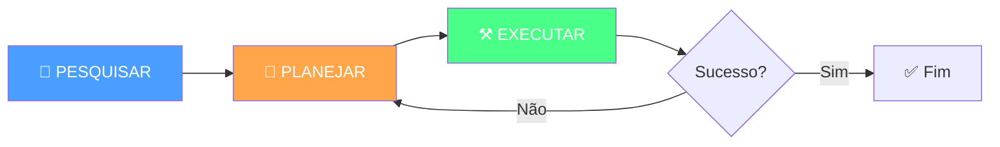
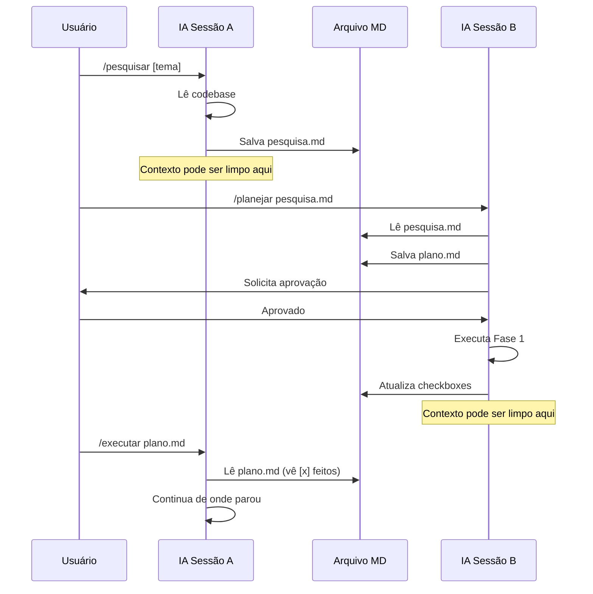

# 🔄 PROTOCOLO DE CONTEXTO LIMPO — Forja Viva
**Versão:** 1.0 | **Data:** 17/01/2026
**Inspiração:** HumanLayer `.claude/commands/` adaptado para BMAD v6

---

## 📋 CONCEITO CENTRAL

O **Protocolo de Contexto Limpo** é um sistema de 3 fases que **preserva qualidade** enquanto **limpa memória da IA** entre execuções. Isso resolve o problema crítico de **context overflow** em tarefas complexas.



### Problema que Resolve
| Cenário | Sem Protocolo | Com Protocolo |
|---------|---------------|---------------|
| Tarefa complexa | IA perde contexto no meio | Cada fase começa limpa |
| Erro descoberto | Precisa explicar tudo de novo | Arquivo de pesquisa preserva |
| Troca de IA | Conhecimento perdido | Artefatos transferíveis |
| Auditoria futura | Impossível — volátil | Trilha de decisões clara |

---

## 📂 ESTRUTURA DE ARTEFATOS

```
_Projeto/
├── PROTOCOLO_CONTEXTO_LIMPO.md    # Este documento
│
├── pesquisas/                      # Fase 1: Pesquisar
│   ├── _TEMPLATE_PESQUISA.md
│   └── YYYY-MM-DD_tema.md
│
├── planos/                         # Fase 2: Planejar
│   ├── _TEMPLATE_PLANO.md
│   └── YYYY-MM-DD_tema.md
│
└── execucoes/                      # Fase 3: Executar
    ├── _TEMPLATE_EXECUCAO.md
    └── YYYY-MM-DD_tema.md
```

---

## 🔬 FASE 1: PESQUISAR CODEBASE

### Propósito
> **Documentar o estado ATUAL do projeto sem sugerir mudanças.**

### Quando Usar
- Nova tarefa complexa (estimativa > 10 tool calls)
- Nova sessão de trabalho
- Mudança significativa de contexto
- Outro agente vai continuar

### Comando
```
/pesquisar [tema]
```

### Regras Críticas
1. **SOMENTE DOCUMENTAR** — Não sugerir melhorias
2. **CITAR SEMPRE** — file:line ou link direto
3. **LER COMPLETO** — Nunca arquivos parciais
4. **ESTRUTURAR** — Seguir template religiosamente

### Template de Pesquisa

```markdown
# 🔬 PESQUISA: [Tema]

**Data**: YYYY-MM-DD HH:MM
**Pesquisador**: [Nome IA]
**Commit**: [hash atual]
**Branch**: [branch atual]

---

## Questão de Pesquisa
[Pergunta original exata]

## Resumo Executivo
[2-3 linhas respondendo a pergunta]

## Descobertas Detalhadas

### [Componente 1]
- **Localização**: `path/to/file.py:linha`
- **Função**: O que faz
- **Conecta com**: Outros componentes
- **Estado atual**: (OK | WARN | BROKEN)

### [Componente 2]
...

## Mapa de Arquivos Relevantes
| Arquivo | Linhas | Função |
|---------|--------|--------|
| `file1.py` | 23-45 | Descrição |
| `file2.yaml` | 1-20 | Descrição |

## Experts BMAD Relevantes
| Expert | Por quê? |
|--------|----------|
| charlotte_mason | Decisão pedagógica envolvida |
| engenharia | Mudança de código requerida |

## Referências de LORE
- `LORE/north_star.yaml` — Princípios X e Y relevantes
- `LORE/guardioes.yaml` — Se guardião envolvido

## Questões Abertas
1. [Pergunta que não foi respondida]
2. [Decisão que precisa ser tomada]
```

---

## 📐 FASE 2: CRIAR PLANO

### Propósito
> **Transformar pesquisa em plano de ação aprovável.**

### Quando Usar
- Após pesquisa completa
- Quando tarefa requer aprovação humana
- Decisões `medium` ou `strategic` (ver orchestrator.yaml)

### Comando
```
/planejar [arquivo-pesquisa.md]
```

### Regras Críticas
1. **LER PESQUISA COMPLETA** — Base de tudo
2. **CONSULTAR EXPERTS** — Qual conselho relevante?
3. **FASES PEQUENAS** — Cada fase = 1 checkpoint
4. **CRITÉRIOS CLAROS** — Como saber se funcionou?
5. **SEM QUESTÕES ABERTAS** — Todas resolvidas ANTES

### Template de Plano

```markdown
# 📐 PLANO: [Nome Descritivo]

**Data**: YYYY-MM-DD HH:MM
**Baseado em**: [pesquisas/arquivo.md]
**Classificação**: quick | medium | strategic
**Aprovador requerido**: [Humano | CM | N/A]

---

## Visão Geral
[O que vamos implementar e por quê]

## Análise do Estado Atual
[Resumo da pesquisa relevante]

## Estado Desejado
[Como ficará após implementação]
[Como verificar que chegamos lá]

## O que NÃO estamos fazendo
[Escopo explícito do que está FORA]

## Experts Consultados
| Expert | Posição | Veto? |
|--------|---------|-------|
| charlotte_mason | "..." | Não |
| jerome_bruner | "..." | Não |

---

## Fase 1: [Nome]

### Objetivo
[O que esta fase alcança]

### Arquivos Afetados
| Arquivo | Ação | Descrição |
|---------|------|-----------|
| `path/file.py` | MODIFY | Descrição |
| `path/new.yaml` | CREATE | Descrição |

### Mudanças Específicas
```python
# Código exato a adicionar/modificar
```

### Verificação Automatizada
- [ ] `python build/build_lessons.py` — Sem erros
- [ ] `python -c "import yaml"` — YAML válido

### Verificação Manual
- [ ] Abrir `site/index.html` — Cards visíveis
- [ ] Testar navegação entre lições

### Checkpoint
> ⏸️ Pausar aqui para verificação humana antes da Fase 2

---

## Fase 2: [Nome]
[Mesma estrutura...]

---

## Estratégia de Testes
### Testes Automáticos
- [Comandos exatos]

### Testes Manuais
1. [Passo explícito]
2. [Passo explícito]

## Rollback
[Como reverter se der errado]

## Referências
- Pesquisa: `_Projeto/pesquisas/arquivo.md`
- Ticket: `[link se existir]`
```

---

## ⚒️ FASE 3: EXECUTAR PLANO

### Propósito
> **Implementar o plano aprovado, fase por fase.**

### Quando Usar
- Após plano **aprovado** pelo humano ou CM
- Retomando trabalho de outra sessão

### Comando
```
/executar [arquivo-plano.md]
```

### Regras Críticas
1. **LER PLANO COMPLETO** — Nunca parcial
2. **VERIFICAR CHECKMARKS** — `[x]` = feito, pular
3. **UMA FASE POR VEZ** — Parar para verificação
4. **ATUALIZAR CHECKBOXES** — No próprio arquivo
5. **REPORTAR DIVERGÊNCIAS** — Se realidade ≠ plano

### Template de Execução

```markdown
# ⚒️ EXECUÇÃO: [Nome do Plano]

**Data Início**: YYYY-MM-DD HH:MM
**Plano Base**: [planos/arquivo.md]
**Executor**: [Nome IA]

---

## Fase 1: [Nome]
**Status**: ✅ Completa | 🔄 Em Progresso | ⏳ Pendente

### Ações Executadas
- [x] Modificado `file.py` — [descrição]
- [x] Criado `new.yaml` — [descrição]
- [ ] Rodado testes — **BLOQUEADO**: [motivo]

### Verificação Automatizada
- [x] `python build/build.py` — ✅ Passou
- [x] YAML válido — ✅ Passou

### Verificação Manual Requerida
> 🔔 **Humano**: Por favor execute:
1. Abrir `site/index.html`
2. Verificar se cards aparecem
3. Responder aqui: ✅ OK ou ❌ Problema

### Divergências Encontradas
| Esperado | Encontrado | Impacto |
|----------|------------|---------|
| Arquivo X existe | Não existe | Alto |

### Notas de Implementação
[Decisões tomadas durante a execução]

---

## Fase 2: [Nome]
**Status**: ⏳ Aguardando Fase 1

---

## Resumo Final
| Fase | Status | Tempo |
|------|--------|-------|
| 1 | ✅ | 15min |
| 2 | ⏳ | - |

## Próximos Passos
[Se incompleto, o que falta?]
```

---

## 🔗 INTEGRAÇÃO COM BMAD

### Mapeamento de Decisões

| Tipo Decisão (orchestrator.yaml) | Requer Pesquisa? | Requer Plano? |
|----------------------------------|------------------|---------------|
| **quick** | ❌ Não | ❌ Não |
| **medium** | ✅ Recomendado | ✅ Recomendado |
| **strategic** | ✅ Obrigatório | ✅ Obrigatório |

### Experts por Fase

| Fase | Experts Típicos | Função |
|------|-----------------|--------|
| Pesquisar | engenharia | Mapear código |
| Planejar | charlotte_mason, conselho relevante | Validar direção |
| Executar | engenharia, qa | Implementar e testar |

### Anti-Viés Aplicável

Para decisões `strategic`:
1. Pesquisa deve incluir **1 expert externo** (pool_semente)
2. Plano deve ter **réplica de outside voice**
3. Execução pode prosseguir se plano aprovado

---

## 🔄 FLUXO DE LIMPEZA DE CONTEXTO



---

## 📌 COMANDOS RÁPIDOS

| Comando | Ação |
|---------|------|
| `/pesquisar [tema]` | Inicia pesquisa documentada |
| `/planejar [pesquisa.md]` | Cria plano de implementação |
| `/executar [plano.md]` | Executa plano aprovado |
| `/continuar [plano.md]` | Retoma execução de onde parou |
| `/status [plano.md]` | Mostra progresso atual |

---

## ✅ CHECKLIST DE USO

### Antes de Começar Tarefa Complexa
- [ ] Tarefa estimada > 10 tool calls?
- [ ] Decisão é `medium` ou `strategic`?
- [ ] Outra IA pode precisar continuar?
- [ ] **Se SIM para qualquer**: Use este protocolo

### Durante Pesquisa
- [ ] Citei todos os arquivos com `file:line`?
- [ ] Li arquivos COMPLETOS, não parciais?
- [ ] Documentei SEM sugerir mudanças?
- [ ] Listei experts BMAD relevantes?

### Durante Planejamento
- [ ] Li pesquisa completa primeiro?
- [ ] Consultei experts relevantes?
- [ ] Cada fase tem verificação clara?
- [ ] Todas as questões abertas resolvidas?
- [ ] Escopo do "NÃO estamos fazendo" claro?

### Durante Execução
- [ ] Li plano completo primeiro?
- [ ] Verifiquei checkmarks existentes?
- [ ] Atualizo checkboxes no arquivo?
- [ ] Reporto divergências imediatamente?
- [ ] Pauso para verificação humana quando indicado?

---

## 📖 REFERÊNCIAS

| Fonte | Descrição |
|-------|-----------|
| [HumanLayer .claude/commands/](https://github.com/humanlayer/humanlayer/tree/main/.claude/commands) | Inspiração original |
| `.bmad/orchestrator.yaml` | Classificação de decisões |
| `.bmad/workflows/` | Workflows existentes do projeto |
| `.bmad/docs/CONTEXT_RESTORE.md` | Sistema de restauração legacy |

---

> **Nota do Maestro**: Este protocolo não substitui a intuição e julgamento da IA, mas fornece uma estrutura para preservar conhecimento entre sessões e garantir qualidade consistente em tarefas complexas.
