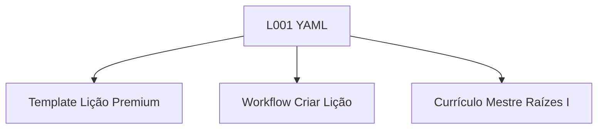

# 🔬 PESQUISA: Pilotagem da Lição L001 (Forja Viva)

**Data**: 2026-01-17 04:40
**Pesquisador**: Antigravity
**Commit**: [current]
**Branch**: [current]

---

## Questão de Pesquisa
> Validar a viabilidade e os requisitos para a criação da Lição Pilot L001 usando o novo Protocolo de Contexto Limpo e o workflow `criar-licao-premium.yaml`. Qual o estado atual do currículo mestre para esta lição e quais experts precisam ser envolvidos?

---

## Resumo Executivo
A Lição L001 ("Identificando Esquerda e Direita") está totalmente definida no Currículo Mestre Raízes I. O workflow `criar-licao-premium` está pronto para uso. Não foram encontrados arquivos pré-existentes da L001 na pasta `02_RAIZES`, o que confirma que é uma criação "greenfield" (zero).

---

## Descobertas Detalhadas

### [Currículo Mestre L001]
| Campo | Valor |
|-------|-------|
| **Localização** | `curriculo/_SISTEMA/CURRICULOS_MESTRE/001_1ANO_RAIZES-1_CURRICULO_MESTRE.md` (Linhas 41) |
| **Título** | 001-L1 - Identifying Right and Left / Identificando Esquerda e Direita |
| **Hook (Ideia Viva)** | "O Norte da Navegadora: Sentir o calor do sol no braço direito..." |
| **Guardião** | Celeste (A Navegadora) |
| **Estado atual** | ✅ Definido e Canônico |

**Trecho Relevante:**
```markdown
| **MV-001** | 001-L1 - Identifying Right and Left / Identificando Esquerda e Direita | **Celeste:** "O Norte da Navegadora: Sentir o calor do sol no braço direito enquanto Celeste ajusta a bússola: no Reino, a direção é o segredo do caminho." |
```

### [Workflow Criar Lição]
| Campo | Valor |
|-------|-------|
| **Localização** | `.bmad/workflows/criar-licao-premium.yaml` |
| **Função** | Orquestrar a criação com fases: Planejamento, Desenvolvimento, Validação |
| **Experts** | Charlotte Mason (Coord), Jerome Bruner (CPA), CS Lewis (Narrativa) |
| **Estado atual** | ✅ Pronto para execução |

### [Diretório de Destino]
| Campo | Valor |
|-------|-------|
| **Caminho** | `curriculo/02_RAIZES/` |
| **Estado** | Limpo (L001 não existe ainda) |

---

## Experts BMAD Relevantes para L001

| Expert | Conselho | Por quê? |
|--------|----------|----------|
| `charlotte_mason` | Pedagogia | Validar se "Esquerda/Direita" é ensinado como "Ideia Viva" (Corporal) e não abstrato. |
| `celeste` | Guardiã | Personagem principal da lição (Tom: Navegadora, precisa, aventureira). |
| `jerome_bruner` | Matemática | Garantir fase Concreta (Enativo) forte para noção espacial. |

---

## Referências de LORE
- `LORE/north_star.yaml` — Princípio 1: "Crianças são pessoas" (Respeitar inteligência espacial).
- `LORE/guardioes.yaml` — Celeste (Raposa do Ártico, Bussola).

---

## Dependências Identificadas



---

## Questões Abertas
1. [x] O arquivo de currículo mestre da L001 existe e está completo? **SIM**
2. [x] O workflow `criar-licao-premium` referencia os arquivos corretos? **SIM**
3. [ ] A estrutura de diretórios para Raízes (1º Ano) já tem a pasta da unidade? (A verificar na execução)

---

## Notas do Pesquisador
O caminho está livre para aplicar o **Protocolo de Contexto Limpo**.
Próximo passo: Criar o Plano de Implementação (Fase 2).
