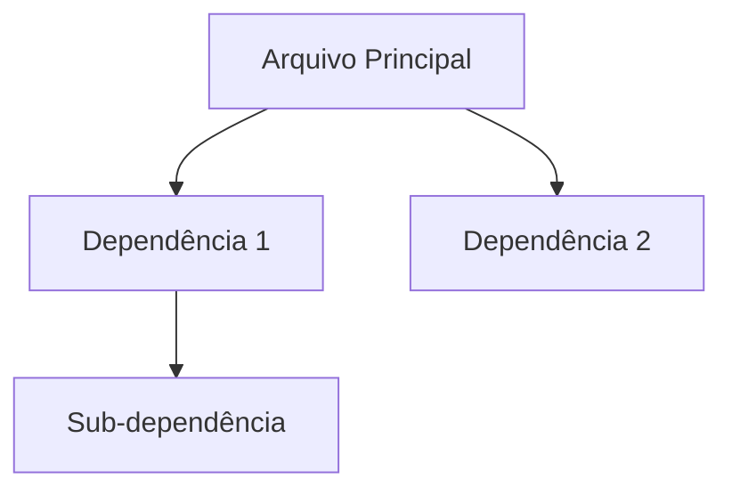

# 🔬 PESQUISA: [TEMA]

**Data**: YYYY-MM-DD HH:MM  
**Pesquisador**: [Nome IA — Ex: Claude, Gemini, GPT]  
**Commit**: [hash — `git rev-parse --short HEAD`]  
**Branch**: [branch — `git branch --show-current`]

---

## Questão de Pesquisa
> [Copie a pergunta EXATA que motivou esta pesquisa]

---

## Resumo Executivo
[2-3 linhas respondendo a pergunta de forma direta]

---

## Descobertas Detalhadas

### [Componente 1]
| Campo | Valor |
|-------|-------|
| **Localização** | `path/to/file.py:linha` |
| **Função** | O que este componente faz |
| **Conecta com** | Outros arquivos/componentes |
| **Estado atual** | ✅ OK / ⚠️ WARN / ❌ BROKEN |

**Trecho Relevante:**
```[linguagem]
# Código encontrado (copiar exato)
```

### [Componente 2]
[Mesma estrutura...]

---

## Mapa de Arquivos Relevantes

| Arquivo | Linhas | Função | Estado |
|---------|--------|--------|--------|
| `file1.py` | 23-45 | Descrição | ✅ |
| `file2.yaml` | 1-20 | Descrição | ⚠️ |

---

## Experts BMAD Relevantes

| Expert | Conselho | Por quê? |
|--------|----------|----------|
| `charlotte_mason` | pedagogia | Decisão pedagógica envolvida |
| `engenharia` | engenharia | Mudança de código requerida |

---

## Referências de LORE
- `LORE/north_star.yaml` — Princípio(s) relevante(s): [listar]
- `LORE/guardioes.yaml` — Se guardião envolvido: [qual]
- `LORE/[outro].yaml` — [Relevância]

---

## Dependências Identificadas



---

## Questões Abertas
1. [ ] [Pergunta que não foi respondida pela pesquisa]
2. [ ] [Decisão que precisa input humano]
3. [ ] [Área que precisa mais investigação]

---

## Notas do Pesquisador
[Observações pessoais, intuições, alertas]

---

> ⚠️ **LEMBRETE**: Este documento é SOMENTE DOCUMENTAÇÃO.  
> NÃO sugira melhorias ou mudanças aqui.  
> Isso será feito na fase de PLANEJAMENTO.
